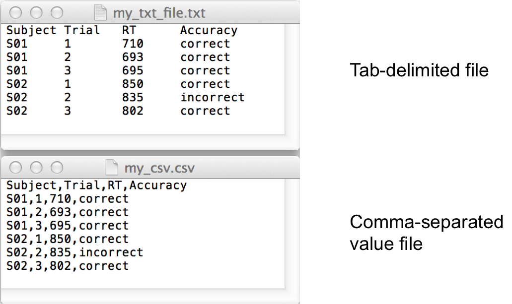
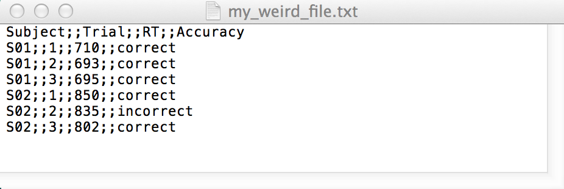

```{r setup, echo=FALSE}
library(knitr)
opts_chunk$set(comment="", message=FALSE, warning=FALSE)
```

# Goals {data-background=#002b36}

## 

By the end of this tutorial, you should be able to:

1. Read data into R
2. Perform basic data manipulations
    + summarize data
    + (cross) tabulation
    + means + SDs
    + subsetting
3. Create simple plots to visualize data

## Caveats

- In R (and any programming language), there are many ways to achieve the same result. Methods differ in **efficiency**, **elegance**, **intuitiveness**, **simplicity**.

- We want you to ***quickly gain working knowledge*** of data wrangling in R. Therefore, we prioritize **simplicity**. 
  
  
# Basic R commands {data-background=#002b36}

## Variable assignment 

The "<-" symbol is used to assign data to a variable name

```{r variable-assignment-1}

# set x equal to the number 1
x <- 1
print(x) 
x # by default, if we call an object, R applies the print function 
class(x)
length(x)

```


## Variable assignment, cont'd
```{r varaible-assignment-2}
# assign a character string to y
y <- "Zombies like brains."
y
class(y)
length(y) # Why is the length 1??

# set z equal to the Boolean value FALSE
z <- FALSE
class(z)
```

## Vectors
```{r vectors}
# set x equal to a vector of numbers
x <- c(1, 2, 3)
x

# change x. Set it equal to the integers from 12 to 23.
x <- c(12:23)
x

# locate the 7th element of x
x[7] 


```

## Basic operations on vectors
```{r basic-operations-on-vectors}
x

# calculate the mean of x
mean(x)

# Multiply each element of x by 8
x * 8

# Your turn... What does this do?
x + x
```

  
# Reading data into R {data-background=#002b36}

## Data formats
R can import data that is stored in a wide variety of formats, including complex formats: **JSON**, **XML**, **Excel workbooks**, **SPSS data files**

The easiest format to import is flat, character-delimited text files: **tab-delimited**, **comma-separated** (CSV)


## Character-separated files




## Import tab-delimited data

- The first step when importing data is to tell R where to look
- Typically this is done by setting the **working directory**
```{r set-working-directory}
# Set working directory
setwd("/Users/kweatherholtz/Desktop/BCS207/data")

# Alternatively, use the 'relative' path
# setwd(~/Desktop/BCS207/data)

# Read in a tab-delimited file
# (and interpret the first row as a header row)
df1 <- read.table(file = "my_txt_file.txt", 
                  header = TRUE, 
                  sep = "\t") # note: "\t" means tab

print(df1)
```


## Import comma-separated data
```{r read-comma-separated-data}
# Read in a tab-delimited file.
# Note that here we are using the RELATIVE path to the data file
df2 <- read.table(file = "~/Desktop/BCS207/data/my_csv.csv", 
                  header = TRUE, 
                  sep = ",") 

print(df2)
```


## <font color="white">Your turn...</font> {data-background=#e28277}
1. <font color="white">Assume you have the file below in your working directory. How would you read this file into R?</font>



- For more information about reading data, see the manual:

```{r}
help(read.table)
```


# Basic data manipulations:<br>Tabulation and cross-tabulation {data-background=#002b36}

## 
Let's look at some real world psycholinguistic data!

```{r load-psycholing-data}
# Step 1: install the 'languageR' package by running the line below
# install.packages('langaugeR')

# Step 2: load the 'languageR' package
library(languageR)

data(lexdec) # a lexical decision data set from languageR
head(lexdec) # print the first few rows of a data frame (default = 6)

```

## A brief note about the internal structure of data objects in R

<code>**str()**</code> allows us to view the 'structure' of a data object

```{r explore-data-file}
str(lexdec)
```


## High-level descriptive statistics

The <code>**summary()**</code> function, when applied to a data frame, provides descriptive statistics about each variable in the data.

```{r summary-command}
summary(lexdec)
```


## Tabulate data
- **How many observations (data points) do we have for each subject?**
- To find the answer, we simply tabulate the data by subject

```{r tabulate-data}
table(lexdec$Subject)

```

## Tabulate data, cont'd.

- **How many males and females participated in this exp?**
- Again, this is a simple tabulation problem

```{r}
# The following line of code tells us the total 
# number of observations from females vs. males. 
table(lexdec$Sex)

# Since we already know that each subject provided the same number 
# of observations (79), we can identify the number of female vs. male 
# participants by dividing each cell in the table above by 79.
table(lexdec$Sex) / 79
```


## Cross-tabulation
- **How many times did each subject judge each class of words (animal words vs. plant words)?**
- For this, we need to cross-tabulate subject by class

```{r crosstabulate-data}
table(lexdec$Subject, lexdec$Class)

## The following line of code is functionally equivalent,
## but less redundant and a bit easier to read.

# with(lexdec, table(Subject, Class))
```

## <font color="white">Your turn...</font> {data-background=#e28277}

>1. <font color="white">Given the results of our cross-tabulation, was the manipulation of <b2>Class (animal words vs. plant words)</b2> a <b2>within-subjects</b2> or <b2>between-subjects</b2> manipulation? </font>
    + Within. Each subject judged both classes.<br>

>2. <font color = "white">How many <b2>native speakers</b2> vs. <b2>non-native speakers</b2> participated in the lexdec experiment?</font>
    + native = 12; non-native = 9<br><code>table(lexdec$NativeLanguage) / 79</code>


# Basic data manipulations:<br>Means and standard deviations {data-background=#002b36}

## Response times

- How long did it take to make lexical decisions (on average)?
- How variable were subjects' reponse times? 

```{r }
# calculate the mean response time across all responses
mean(lexdec$RT)

# NOTE: RTs in the pre-packaged lexdec dataset were log-transformed;
# hence, the mean (log) RT of 6.38 is ~590ms
exp(6.38509)

# calculate the standard deviation for RTs
sd(lexdec$RT)
```

## Response times for correct responses

We typically only care how long it took subjects to respond correctly. Using the <code>**subset()**</code> function, we can omit errors


```{r response-times-for-correct-responses}
# how many incorrect responses are we going to omit
table(lexdec$Correct)

# locate ONLY correct responses; save output to a new data frame
correct_resp <- subset(lexdec, Correct == "correct")

# make sure the subset operation worked
table(correct_resp$Correct)

# calculate the mean RT from our new data frame
mean(correct_resp$RT)
```

## <font color="white">Your turn...</font> {data-background=#e28277}

1. <font color="white">How many milliseconds did it take on average for non-native English speakers to make a correct lexical decision? </font>

2. <font color="white">How many milliseconds did it take on average for native English speakers to make a correct lexical decision for animal words? </font>

```{r subsetting-based-on-multiple-conditions, eval=FALSE}
## HINT: when using the subset() function, you can
## chain multiple conditions together using the "&" symbol.

subset(my_data, 
       Var1 == "A" & # select only instances of Var1 that equal "A"
       Var2 == "B" & 
       Var3 != "C"   # select ALL instances where Var3 DOES NOT EQUAL "C"
       )

```


## How accurate was each participant?

We can use cross-tabulation to calculate by-subject accuracy

```{r cross-tab-to-calculate-bySubject-accuracy-Step1}
# Step 1: calculate the number of correct and incorrect 
# responses from each subject. Assign output to a variable
# so we can perform further calculations on this matrix.

xt <- table(lexdec$Subject, lexdec$Correct)
print(xt)

```

## How accurate was each participant?
```{r cross-tab-to-calculate-bySubject-accuracy-Step2}
# Step 2a: use the rowSums() function to calculate the total 
# number of observations per subject (in this case, it should be 79)
rowSums(xt)

# Step2b: divide each cell in the matrix by the corresponding 
# row total, which gives us the proportion of correct 
# and incorrect responses for each subject
acc.prop <- xt/rowSums(xt)

print(acc.prop)
```


## Convert accuracy from proportion to %
```{r convert-accuracy-from-proportion-to-percent}

# multiply each cell by 100 and round to 1 decimal place
acc.prct <- round(acc.prop * 100, digits = 1)

print(acc.prct)
```

## Average accuracy ***across subjects***

The <code>**colMeans()**</code> function computes the mean of each column in a data object

```{r calculate-average-accuracy-across-subjects}
colMeans(acc.prct)
```

# Basic data visualization {data-background=#002b36}

## Histograms
A histogram is a way to visualize the distribution of data along a single dimension

```{r basic-histrogram-of-RTs}
# with the hist() function, you can create a histogram
# by simply specifying the x-axis variable
hist(x = lexdec$RT)
```

## Embellished histogram

```{r embellished-histrogram-of-RTs}
hist(x = lexdec$RT,
     col = "#71e9f4",       # change bar color using HexDec values
     # col = "red",
     xlab = "log(RTs)",     # change x-axis label
     ylab = "count",        # change y-axis label
     main = "My histogram", # change plot title
     breaks = 30            # create 30 break points (i.e., smaller bins)
     )

```

## Scatterplot ( XY plot )

A scatterplot is a way to visualize the relationship between two continuous variables: ***does change along the x-axis predict change along the y-axis?***

```{r simple-scatterplot}
plot(x = lexdec$Frequency, y = lexdec$RT)
```

## Embellished scatterplot
```{r embellished-scatterplot}
plot(x = lexdec$Frequency, y = lexdec$RT,
     pch = 16, # change the plot character (i.e., symbol)
     col=rgb(red = 0.35, green = 0, blue = 0.1, 
             alpha = 0.15), # add alpha transparency
     xlab = "log-transformed Frequency",
     ylab = "log-transformed RTs",
     frame.plot = FALSE # remove the frame around the plot
     )

```

## <font color="white">Your turn...</font> {data-background=#e28277}
1. <font color="white">Make a scatterplot to show whether an increase in **FamilySize** appears to predict a change (increase or decrease) in **RTs**. </font>

2. <font color="white">Make a scatterplot to show whether an increase in **Length** appears to predict a change in **RTs**. </font>

3. <font color="white">Reason about the directionality of these effect. Why might we expect a change in this direction?</font>
    
```{r }
## HINT: to interpret your scatterplots, it might be useful to 
## read the documentation of the 'lexdec' dataset to understand
## what FamilySize and Length are measuring.
help(lexdec)

```

## 
```{r echo=FALSE, fig.width=7.5, fig.height = 6}
library(ggplot2)
library(ggthemes)
library(gridExtra)

p1 <- ggplot(data = subset(lexdec, Correct == "correct"), aes(x = FamilySize, y = RT)) +
  geom_point(color = "purple", alpha = 0.4) +
  geom_smooth(method = "lm") +
  geom_rangeframe() +
  theme_minimal()
  
p2 <- ggplot(data = subset(lexdec, Correct == "correct"), aes(x = Length, y = RT)) +
  geom_point(color = "purple", alpha = 0.4) +
  geom_smooth(method = "lm") +
  geom_rangeframe() +
  theme_minimal()

grid.arrange(p1, p2, nrow = 1, top = "Effect of Family Size and Word Length on RTs")

```


# Final questions or comments? {data-background=#002b36}

